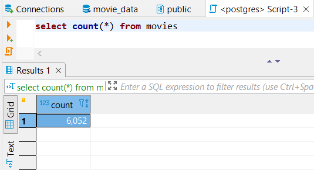
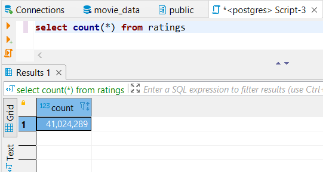

# Amazing Prime Hackathon
## Project Overview
#### This analysis project provides a visualization for predicting which low-budget movies being released will become popular.  Data from Wikipedia (movies released since 1990) and Movielens/Kaggle (movie ratings) were utilized in this project. The tasks in this project:
- Extract the data from the data sources
- Tranform the data in clean data set using Python and Pandas
- Load the data set into a SQL table

## SQL Queries
#### Row count for Movies Table

#### Row count for Ratings Table
